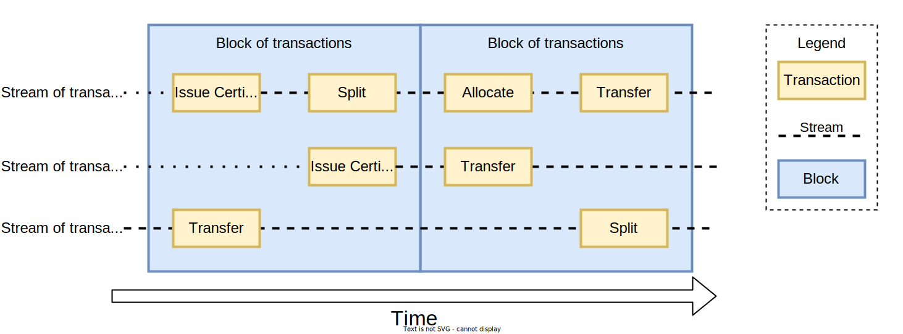
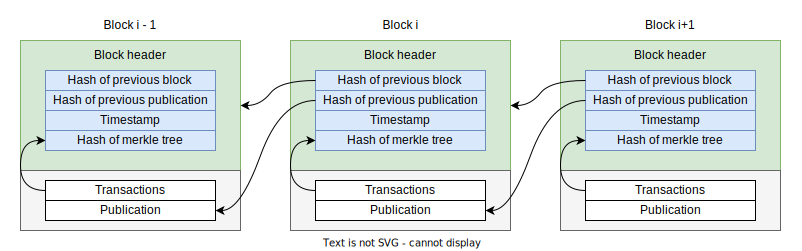

# Blockchain

## Block

A registry is in itself a blockchain, and all transactions are recorded in blocks,
but not the same way as a blockchain like Bitcoin or Ethereum.
It does not use proof-of-work or proof-of-stake to create blocks, since no consensus is needed,
and therefore no expensive mining or calculations are needed.

It creates a new block after a set amount of time, and the block is then published to an immutable log
to ensure that the block cannot be changed.

A block is a list of transactions that are recorded on a registry,
and can be described by a block header.

| Name | Description |
| :--- | :--- |
| **previous header hash** | A sha256 hash of the previous block header. |
| **previous publication hash** | A sha256 hash of the previous publication record. |
| **merkle root hash** | A sha256 of the merkle root of the transactions in the block. |
| **timestamp** | Timestamp of when the block was created. |

All transactions in a block are hashed and added to a [merkle tree](./merkle-tree.md), and the root hash of the merkle tree is added to the [block header](./blockchain.md) in the [chain](./blockchain.md).

## Chain

Each block in a blockchain contains a list of transactions that are recorded on a registry.
The block can be described by a block header.

Each block header contains the following information:

- **Previous Header Hash**: A SHA-256 hash of the previous block header.
- **Previous Publication Hash**: A SHA-256 hash of the previous publication record.
- **Merkle Root Hash**: A SHA-256 hash of the [Merkle root](./merkle-tree.md) of the transactions in the block.
- **Timestamp**: The timestamp of when the block was created.

Including the Merkle root hash in the block header ensures that the transactions in a block cannot be changed without it being tamper-evident.

Including the previous header hash in the block header ensures that the blocks are linked together in a chain, making it difficult to change a block without changing all subsequent blocks.

The timestamp is added so there is a record of when the block was created.

The previous publication hash is used to ensure that the previous publication also cannot be changed without it being tamper-evident.

## Genesis Block

The first block in a blockchain is called the genesis block.
Both the previous header hash and the previous publication hash are set to `0` in the genesis block.

## Publication

In a classical blockchain, like Bitcoin or Ethereum, the blocks are created by a consensus algorithm,
like proof-of-work or proof-of-stake, where the entire network agrees on the next block to be created.

In ProjectOrigin, each registry is its own blockchain, and the blocks are created by the registry itself, so no consensus is needed or used.
This means that no expensive mining or calculations are needed, and that each registry can handle a large number of transactions.
A publication is performed by a registry after a block has been created.

Instead of a consensus algorithm, each new block is created after a set amount of time and published to an immutable log.
The immutable log ensures that the block cannot be changed, and that the transactions in the block are tamper-evident.

A user can verify that their transaction is included in a block using [Merkle proofs](./merkle-tree.md#merkle-proofs).
They can also verify that a block is valid by checking the previous header hash, the previous publication hash, and the Merkle root hash.

## Immutable Log

### Concordium Blockchain

The Concordium Blockchain is currently used is the only currently implemented immutable log for Project Origin.
Here a RegisterData transaction is performed on the Concordium Blockchain to publish the block header.

### Other immutable logs

Other implementations can be used, but it is up to the network to define which immutable log to use.
