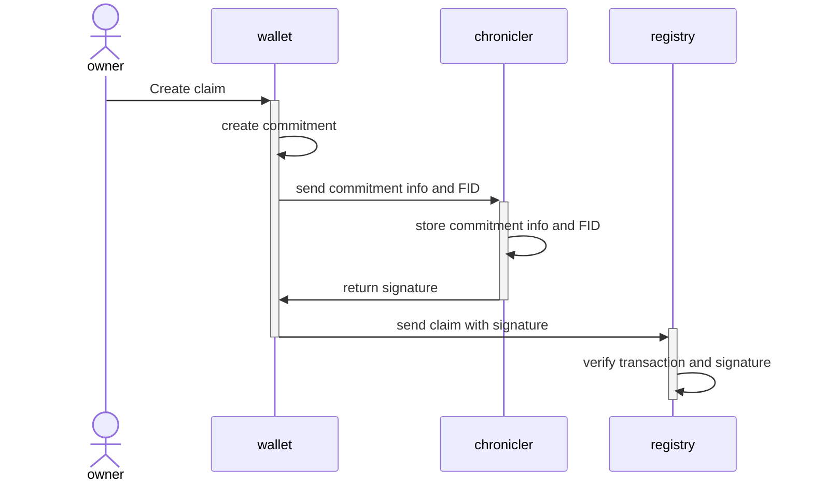

# Chronicler

The Chronicler is a system that collects claim information in a distributed and privacy-preserving way.

## The problem

All information about quantities of energy are hidden on the registries behind Pedersen commitments.
The information of the size of claims are only stored in the users individual wallets, which could be hosted anywhere.

This creates the issue that there is no way for a government or other entity to statistically report on how much have been claimed, without asking each individual wallet owner, which is not feasible.

## Solution

The solution is to have a system that can collect the information in a privacy-preserving way, and then aggregate the information in a way that can be reported on.

The Chronicler feature can be enabled on a given gridArea in the [network configuration](./network.md#network-configuration) and will require all claims to first have registered the amounts in the chronicler which will return a signature that it has received the claim intent.

This signature must then be included in the transaction to the registry, and the registry will then verify the signature before accepting the transaction.

The chronicler will then continually process registries and collect the information based on the claim intents needed for the area to provide statistics on how much has been claimed within an area in a verifiable and trustable way without compromising the privacy of the users.

## More information

Can be found in the [Chronicler](../chronicler/index.md) documentation.
