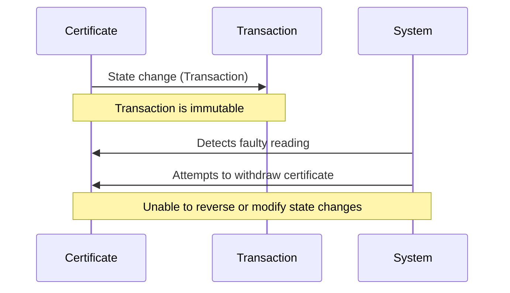

# Withdraw transaction

> [!NOTE]
> The issue command is only valid for **Issuing bodies** for a given area.

> [!IMPORTANT]
> This command has **NOT** been implemented yet.

There is a number of outstanding issues to discuss in terms of this command's functionality.

- What should happen with claims that uses a certificate?
- It there a period within which it is allowed?

## Withdraw approach

We are currently facing an issue with the withdrawal functionality of a certificate in case of faulty readings. The problem arises if there have been state changes on the certificates in the form of transactions. These transactions are, by nature, immutable in Project Origin.

This immutability presents a challenge when we need to withdraw a certificate due to faulty readings. We are unable to reverse or modify the state changes once they have been made.

This diagram shows the sequence of events:

- A state change occurs on the certificate in the form of a transaction.
- The transaction is immutable, meaning it cannot be changed once it has been made.
- The system detects a faulty reading on the certificate.
- The system attempts to withdraw the certificate.
- The system is unable to reverse or modify the state changes on the certificate, leading to the issue.

We are actively exploring different strategies to address this issue. The strategies, their feasibility, and our verdict on each are outlined in the table below:

| Strategy | Description | Feasibility | Verdict |
| --- | --- | --- | --- |
| Transaction Reversal | Implement a new transaction type that signifies the reversal of a previous transaction. This would not alter the original transaction but would effectively negate its impact. | TBD | TBD |
| Faulty Certificate Flagging | Introduce a mechanism to flag certificates that have been issued based on faulty readings. This would not withdraw the certificate but would indicate to any potential users or systems that the certificate is not valid. | TBD | TBD |
| Certificate Replacement | Issue a new, corrected certificate to replace the faulty one. The original certificate could be flagged as faulty to prevent its use. | TBD | TBD |
| Dual Transaction Approach | For every transaction, create a 'shadow' transaction that can be used to reverse the original transaction if necessary. This would double the number of transactions but would provide a straightforward way to handle faulty readings. | TBD | TBD |
| Certificate Replacement with Claim ID Reference | Issue a new, corrected certificate to replace the faulty one. The original certificate could be flagged as faulty to prevent its use. The new certificate would reference the claim IDs of the original certificate to maintain a link between the two. This would allow users or systems to trace the new certificate back to the original one, providing a clear audit trail. | TBD | TBD |

### Addendum

At the "Project Origin gettogether" 24.06.2024 the following proposals where discussed but let us start by framing the issue and the possible gridlock problems as follows.

#### Notes on:

**Data Quality**

- Corrections up to 3 years after measurement
    - Within 3 months, 5% of all measurements are corrected
    - After 3 months, there are less than 1% corrections

**Balancing Market**

- After 1 month (Refixing), there are no changes - the window is locked.

**Issuance of Certificates**

- Certificates should be issued based on settlement (observations and estimates) and not solely on measurements (observations)
- Settlement and certification of energy would be incomprehensible if they were solely based on measurements, as they can be incomplete and in some cases impossible to obtain.

**Measurement Data**

Estimate over a day
- Over 24 hours
- If 23 hours are measured and 1 hour is not, the 1 hour is estimated
    - All 24 hours are labeled as estimated with the lowest data quality

**Wholesale Settlement**

- 5 working days after
- 1 month afterwards

**Balance Fixing**

- Almost no changes from 8 to 13 calendar days - moving towards 8.

**Correction Data Closure**
1. 3 months
2. 18 months
3. 36 months

**Master Data Errors**

- Such as incorrect meter reported

- +- 1% error on existing meter
- Transmission loss of 4%

**Best Effort**

- Sliding window for certificate lifespan and making it data-driven based on the amount of corrections
- We will not achieve complete accuracy as we cannot track electrons
- Minimum thresholds for corrections need to be set
    - Minimum amounts of Wh
    - Corrections of master data errors
    - Corrections should be done through the data hub's time series
    - After balance fixing

**Greater Insight into Consumption and Production**

- The data hub is benchmarked
    - E17 - production
    - E18 - consumption
- Requires flexible settlement (hourly based)

### Main problem space

The main problem space revolves around the immutability of the registry, event sourcing approach, and immutable logging. When it comes to the withdrawal functionality, there are two possible approaches:

1. Addition to Current Certificate: In this approach, the faulty readings would be flagged on the current issued certificate, indicating that it is not valid. However, a new, valid certificate would not be issued. This approach allows for traceability and maintains the integrity of the original certificate.

    - A parallel corrected Granular Certificate that corrects the value of the original certificate
        - There is a homomorphic property of Pedersen commitments that makes for addition/subtraction/division/multiplication of the existing certificates that can facilitate such a procedure and still ensure verifiability
        - It comes with a higher implementation technical overhead - and it does not solve the *Downside* issue. 

2. Total Withdrawal and Reissuance: Alternatively, the current issued certificate would be completely withdrawn, and a new, valid certificate would be issued to replace it. This approach ensures that only valid certificates are in circulation but may require additional steps for traceability.

The choice between these approaches depends on the specific requirements and constraints of the system. It is important to carefully consider the impact on traceability, auditability, and the overall user experience.

1. Addition to current certificate
    - *Upside* In case of correction to the upside, ie the issued is lower than *issued < corrected* the corrected value there is more of the asset and it has no impact on the existing claim owners of the produced energy.
    - *Downside* there is issued more than the corrected value *issued > corrected* there is less than claimed in the first place, this leaves some claim owner to have to loose some of the claims they have and that distribution of loss can either be
        - Distributed among claim owners of the certficate
        - Deducted from lesser prioritized costumers
        - Complete recall of the certificate and reissue of the certificate
            - Requires that the consumption side certificates never expires
            - Requires market makers to settle the claims in the market after all other similar timeframe issued certificates are settled. The result being low supply and can affect price-mechanisms and other logistic issues
            - A potential solution could be issuance of GO's based on Granular Certificates as an overflow mechanism for GC's - that would be under the requirements of GO's. An illustrated example would be that at least 1 MWh for a certificate could be issued or that a new type of GO created from a mix-match of GC's would be legible under the AIB GO scheme. 

# Conclusion

The element of uncertainty of observations leads us to a "wicked problem" of adopting an immutable software solution to the uncertainty that comes with metering devices and their real world observations and fault handling in general. The good news is that it is already "solved" by the markets sending invoices to their end-customer, the practice however can differ from market to market and even differ between DSO suppliers. This means that we can tackle the issue considering a technical solution for project origin keeping in mind that the solution will never guarantee 100% truth in the observations, but certainty of the underlying transaction in a working solution - given the assumption that all actors in the network operate without malicious intent.

The discussion is still ongoing but for now these are the conclusions of the "Project Origin gettogether" 24.06.2024.

Please chip in if you have valuable insights - we are open for discussion and pull-request.

