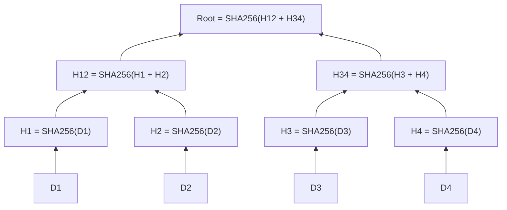
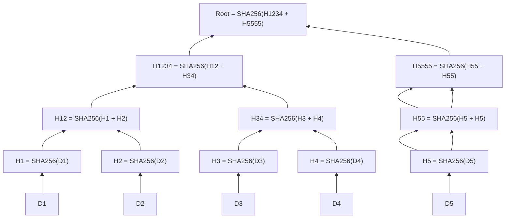
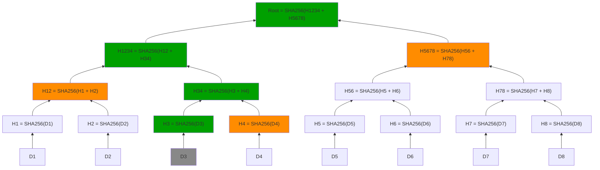

# Merkle trees

Merkle trees are a type of data structure used in computer science and cryptography to efficiently and securely verify the integrity of large sets of data. They are particularly useful in blockchain technology and distributed systems.

## What Merkle Trees Do

Merkle trees allow for quick and secure verification of data integrity.
They enable a system to verify that a piece of data belongs to a larger dataset without needing to access the entire dataset.
This is achieved by using cryptographic hashes to create a tree structure where each leaf node represents a hash of a data block, and each non-leaf node represents a hash of its child nodes.

## How to Calculate Merkle Trees Using SHA256

1. **Hash the Data Blocks**: Start by hashing each individual data block using SHA256. These hashes form the leaf nodes of the Merkle tree.
2. **Pair and Hash**: Pair the leaf nodes and hash each pair to form the next level of the tree. If there is an odd number of nodes, the last node is paired with itself.
3. **Repeat**: Continue pairing and hashing the resulting nodes until only one node remains. This final node is the root of the Merkle tree, also known as the Merkle root.

### Example Calculation

1. **Data Blocks**: `D1`, `D2`, `D3`, `D4`
2. **Leaf Hashes**: `H1 = SHA256(D1)`, `H2 = SHA256(D2)`, `H3 = SHA256(D3)`, `H4 = SHA256(D4)`
3. **First Level**: `H12 = SHA256(H1 + H2)`, `H34 = SHA256(H3 + H4)`
4. **Root**: `Root = SHA256(H12 + H34)`

This Merkle root can be used to verify the integrity of the entire dataset efficiently.
If any data block is altered, the hash of its corresponding leaf node will change, causing a mismatch in the Merkle root.

## Unbalanced Merkle Trees

In some cases, the number of data blocks may not be a power of two, resulting in an unbalanced Merkle tree.
In such cases, the last node is duplicated to form a pair with itself during the pairing process.
This duplication ensures that the tree remains balanced and the integrity verification process works correctly.

### Example of Unbalanced Merkle Tree

Let's consider an example where we have 5 data blocks: `D1`, `D2`, `D3`, `D4`, and `D5`. Since 5 is not a power of two, the last node (`D5`) will be duplicated to form a pair with itself during the pairing process.

The calculation of the Merkle tree for this example would be as follows:

1. **Data Blocks**: `D1`, `D2`, `D3`, `D4`, `D5`
2. **Leaf Hashes**: `H1 = SHA256(D1)`, `H2 = SHA256(D2)`, `H3 = SHA256(D3)`, `H4 = SHA256(D4)`, `H5 = SHA256(D5)`
3. **First Level**: `H12 = SHA256(H1 + H2)`, `H34 = SHA256(H3 + H4)`, `H55 = SHA256(H5 + H5)`
4. **Second Level**: `H1234 = SHA256(H12 + H34)`, `H5555 = SHA256(H55 + H55)`
5. **Root**: `Root = SHA256(H1234 + H5555)`

In this example, the unbalanced Merkle tree ensures that the integrity verification process works correctly, even with a non-power-of-two number of data blocks.

## Merkle Proofs

Merkle Proofs, also known as Merkle Paths or Merkle Inclusion Proofs, are cryptographic proofs that allow a client to verify the inclusion of a specific data block in a Merkle tree without having to download the entire tree.

To generate a Merkle Proof, the client needs the following information:
1. The data block that needs to be verified.
2. The Merkle root of the tree.
3. The sibling nodes along the path from the leaf node to the root.

The Merkle Proof is constructed by providing the client with the sibling nodes along the path from the leaf node containing the data block to the root of the Merkle tree. Each sibling node is the hash of the concatenation of its two child nodes.

The client can then use the Merkle Proof to verify the inclusion of the data block by performing the following steps:
1. Start with the hash of the data block.
2. For each sibling node in the Merkle Proof, concatenate the hash of the data block with the sibling node and hash the result.
3. Repeat step 2 until reaching the Merkle root.
4. Compare the resulting hash with the provided Merkle root. If they match, the data block is verified to be included in the Merkle tree.

### Example Merkle Proof

The graph above represents a Merkle tree with 8 data blocks (`D1` to `D8`). The client wants to verify the inclusion of `D3` (gray) in the Merkle tree using a Merkle Proof.

The Merkle Proof for `D3` consists of the following sibling nodes: `H4`, `H12`, and `H5678` (Orange).
The client can use this information to verify the inclusion of `D3` in the Merkle tree by calculating the hash path (Green) from `D3` to the root and comparing it with the provided Merkle root.

## Why Merkle Trees Are Useful

Clients can verify the inclusion of data blocks in a Merkle tree without downloading the entire tree, reducing bandwidth and computational costs, reducing it to O(log n).

There is no way to create a false proof of inclusion for a non-existent data block, as the cryptographic hashes ensure the integrity of the tree.
And any minor change in the data block will result in a completely different Merkle root.

## More Information

[Merkle Tree on Wikipedia](https://en.wikipedia.org/wiki/Merkle_tree)
