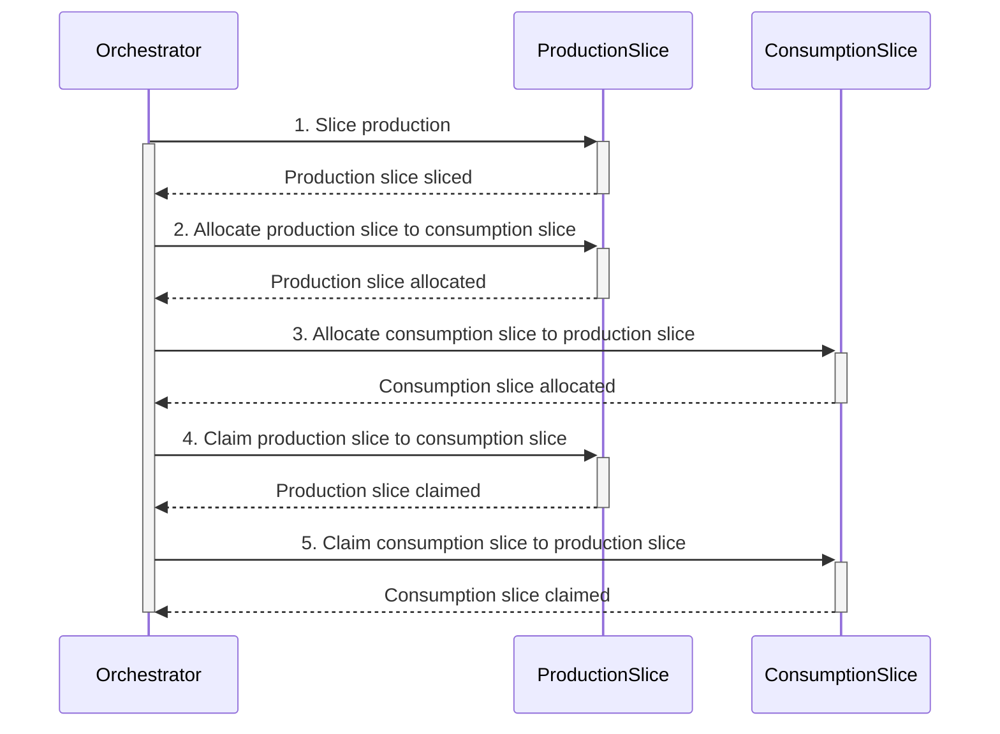

# Orchestration

Orchestration is the process of managing and coordinating the execution of multiple transactions.
It is a key concept in ProjectOrigin, as it allows for the creation of complex transactions that involve multiple registries.

## Claim example

Some actions within ProjectOrigin require multiple transactions to be executed in a specific order.

For example when a user wants to [claim production and consumption of electricity](./granular-certificates/transactions/claim.md).

1. First both the production and consumption slices must be of equal size, otherwise one must be sliced to fit the other.
2. Then the user must allocate the production slice to the consumption slice.
3. Then allocate the consumption slice to the production slice.
4. Then claim the production slice to the consumption slice.
5. Then claim the consumption slice to the production slice.

This is a complex process that requires multiple transactions to be executed in a specific order, and is a good example of when orchestration is needed.

## Compensating transactions

In the event of a failure during the execution of a transaction,
the orchestrator could create compensating transactions to undo the effects of the allocated transactions.

The orchestrator must through the entire process have access to the nessisary keys to sign the transactions for the certificates.

## Across multiple registries

Since each transaction is orchestrated and executed separately, it is possible to execute transactions across multiple registries.
The verifier in one registry can verify the validity of a transaction in another registry, as long as they are part of the same federated network.

This allows for complex transactions that involve multiple registries, and is a key feature of ProjectOrigin.

### Latency vs Throughput

When orchestrating transactions across multiple registries,
it is important to keep in mind that the latency between transactions executing is the block time of the registries in the network.

Since this is a "accouting system" and not a "real-time system", the latency is not a problem, but the throughput is.
And since each registry can process transactions for different streams in parallel, there is a potential for high throughput.
