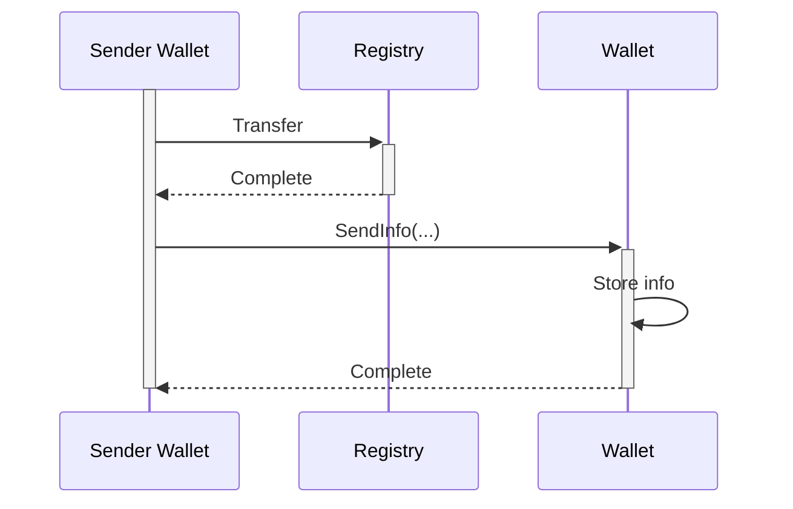

# Receive slice

When ever a wallet needs to receive a slice, the process is a two step process for the sender.

1. The sender needs to create a transaction that sets the ownership of the slice to the receiver in the registry
2. The sender needs to send information about the slice to the receiver

This is true for both when the sender is an issuer or another wallet.

## The problem

The problem is that the digital ownership of resources is specified by which public key that owns the slice in the registry,
and the process of updating the registry does not automatically update the wallet.

In other blockchains the ownership of a token is specified by the private key that owns the address that the token is stored in.
But in Project Origin the ownership of a slice is not held in an address, so there is no way to know which slices are bound to which keys without being given the information.
There is also other cryptographic information that is needed to be shared as well, quantity of the slice, random number for the commitment and attribute information.

### No sensitive data in the registry

Monero also uses pedersen commitments to hide the amount of a transaction, but it encrypts the amount with the receivers public key, and stores this in the blockchain.
This could be a potential security risk, as any leak of the key or an exploit in the algorithm could reveal the amount of the transaction.
This also goes against the principle of `Defense in depth` where multiple layers of security is used to protect the data.

Therefore we never store sensitive data in the registry, encrypted or not.
We only store one way data like commitments, hashes or zero-knowledge proofs to enable the verification of the data.

## Solution

The solution is to have the sender send the information to the receiver,
and the receiver can then verify the information and store it in the wallet.

1. First step is alway to create the transaction on the registry.
2. Once the registry is finalized the sender sends the information to the receivers wallet.
3. The receivers wallet can then verify the information against the registry and store it.

This insures that no sensitive data is stored in the registry, and is only sent pier to pier between the sender and receiver.
While the registry only holds the commitments and hashes needed to verify the data.

## Issue flow

When issuing a new certificate, the flow is very similar to the transfer flow.

1. The issuer first issues the certificate to the registry
2. Once the registry is finalized the issuer sends the information to the receivers wallet
3. The receivers wallet can then verify the information against the registry and store it.
