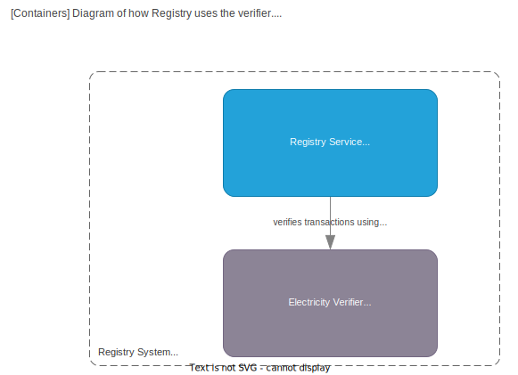

# Registry

> In ProjectOrigin a registry is a **system** that holds the state of a streams and processes transactions.

It uses a verifier to [verify](./verifier.md) the validity of a transactions, based on the state of the stream and the ruleset.

A Registry **main responsibility** is to ensure the rules of the network are applied to the data it holds,
and provide a tamper-evident[^tamper] log of all changes to the data.

[^tamper]: Tamper-evident ensures it is possible to detect if the data has been changed, but cannot prevent it.
Any system can be tampered with, but the goal is to make it detectable and hold the hosting part accountable.

Each registry can hold any number of [GCs](../granular-certificates/readme.md).
It is up to the issuing body[^ib] to specify which registry to put a GC on
at the time of issuance with the help of the [Federated Certificate ID](./granular-certificates/federated-certifate-id.md),
where it is **identified** by a unique name.

[^ib]: The issuing body is the entity that has the legal right to issue GCs within a given area.

The life-cycle of a single GC **always stays within the same registry** as to ensure atomic operations on the GC
and reduce the need for distributed transactions.

In practice this makes each registry the authority of what is the truth for the current state of a GCs held within it.

A registry enables one to queue transactions for processing, which it then uses a [verifier](./verifier.md) to verify the validity of the transaction.

One import part of the registry is that it only verifies transactions for a given stream sequentially, to ensure that no double-spending can occur.

All valid transactions are then stored in the corresponding stream.

The registry then creates a [block of transactions](./blockchain.md#block), which it then publishes to the immutable log.

## System documentation

More documentation can be found in the [Registry](../registry/index.md) project.

