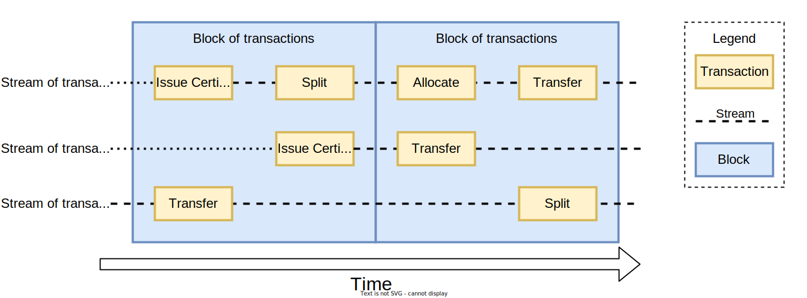

# Transactions, streams and blocks

Everything in Project Origin on a registry happens through a transaction, and every transaction relates to a specific stream on a registry.

## Transactions

A transaction is a request to a registry to perform a given action on a stream.

A transaction is always an atomic operation, meaning that it either succeeds or fails, and only makes a change to a single stream.

A transaction is always signed by the a valid entity.
For an existing certificate, the entity must be the owner of the slice one wants to perform an action on.
For a new certificate, the entity must be an issuing body.

A registry then verifies the signature and the validity of the transaction and if everything is valid, it will be recorded on the stream.

A [network](./registry.md#federated-network) might set specific rules that apply for certificates in a network.
For example, a network might require that all certificates must be issued containing a specific attribute or
other rules that apply for transactions to be valid.

A transaction is final and cannot be changed once it has been recorded on the stream and included in a block.

## Streams

An stream is a list of transaction that relates to a specific certificate on a registry.

A stream is created by a [issue transaction](../granular-certificates/transactions/issue.md).

All transactions on streams are recorded sequentially and are immutable. Once a transaction is recorded, it cannot be changed.

The registries use these streams to be able to process multiple streams in parallel while ensuring that the order of transactions on a stream must be sequential to ensure that no double-spending can occur.

Compensating transactions can be performed on some transactions to revert an action, but it will always be recorded on the stream.

## Blocks

A registry is in itself a blockchain, and all transactions are recorded in blocks,
but not the same way as a blockchain like Bitcoin or Ethereum.
It does not use proof-of-work or proof-of-stake to create blocks, since no consensus is needed,
and therefore no expensive mining or calculations are needed.

It creates a new block after a set amount of time, and the block is then published to an immutable log
to ensure that the block cannot be changed.

A block is a list of transactions that are recorded on a registry,
and can be described by a block header.

| Name | Description |
| :--- | :--- |
| **previous header hash** | A sha256 hash of the previous block header. |
| **previous publication hash** | A sha256 hash of the previous publication record. |
| **merkle root hash** | A sha256 of the merkle root of the transactions in the block. |
| **timestamp** | Timestamp of when the block was created. |

### Merkle tree

A merkle tree is a tree of hashes, where the root hash is a hash of all the hashes in the tree.

In a block all transactions are hashed and added to a merkle tree, and the root hash of the merkle tree is added to the block header.
This ensure that the transactions in a block cannot be changed without it being tamper-evident.

This can also be used to create a proof of inclusion for a transaction in a block. where only the surrounding hashes are needed to prove that a transaction is included in a block.

More information about merkle trees can be found [here](../unique-proofs-using-tries-merkleproofs.md).

## Publication to immutable log

A publication is when a block header is published to an immutable log.

An immutable log is a log that cannot be changed,
and is used to ensure that the block header cannot be changed and therefore transactions in the block cannot be changed,
without it being tamper-evident.

A publication is performed by a registry after a block has been created.

### Concordium Blockchain

The Concordium Blockchain is currently used is the only currently implemented immutable log for Project Origin.
Here a RegisterData transaction is performed on the Concordium Blockchain to publish the block header.

### Other immutable logs

Other implementations can be used, but it is up to the network to define which immutable log to use.
