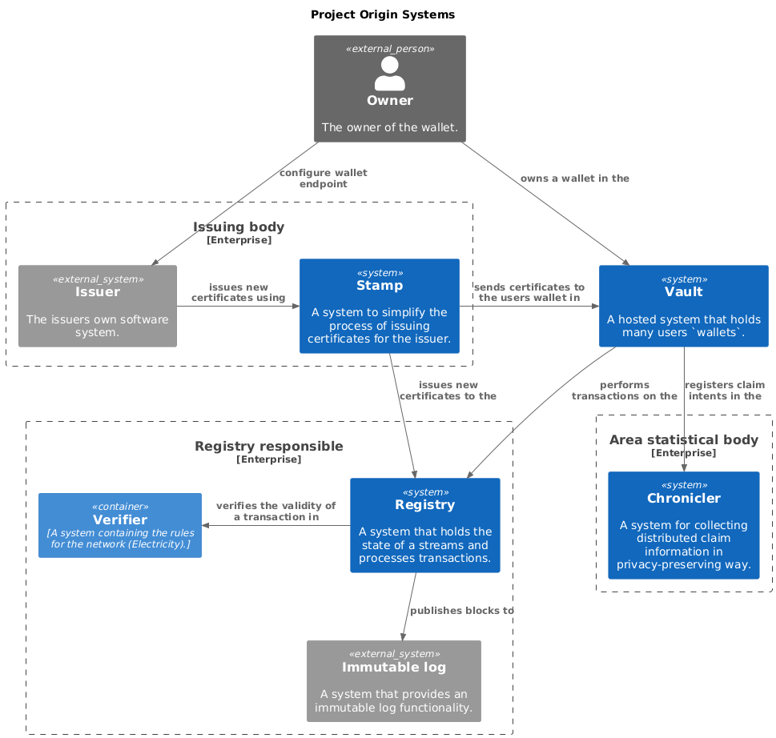

# Project Origin - Overview

Below is a diagram of all the Project Origin systems and how they interact with each other.

- Owner - The entity which owns the GCs and their wallet which they are stored in.
- Issuing body - The entity with the responsibility of issuing new GCs for a given area.
  - Issuer - Their internal system responsible for issuing new GCs using Stamp.
  - Stamp - Simplifies the issuing process by handling all cryptographic operations and orchetration between registry and the wallet on behalf of the issuer.
- Vault - A system which can hold many users wallets. Simplifies the users access to their GCs, and abstracts the complexity of the underlying systems.
- Registry responsible - The entity responsible for running the registry in the network
  - Registry - A system that holds the state of a streams and processes transactions.
  - Verifier - A system containing the rules for the network (Electricity).
  - Immutable log - Currently Concordium is the only system which has been implemented as an immutable log for the network.
- Area statistical body - The entity responsible for collecting statistics about claims in the area.
  - Chronicler - A system for collecting distributed claim information in privacy-preserving way.


<!-- https://www.plantuml.com/plantuml/uml/SyfFKj2rKt3CoKnELR1Io4ZDoSa70000
```plantuml
@startuml
!include https://raw.githubusercontent.com/plantuml-stdlib/C4-PlantUML/master/C4_Container.puml

!define DEVICONS https://raw.githubusercontent.com/tupadr3/plantuml-icon-font-sprites/master/devicons
!define FONTAWESOME https://raw.githubusercontent.com/tupadr3/plantuml-icon-font-sprites/master/font-awesome-5
!include DEVICONS/angular.puml
!include DEVICONS/java.puml
!include DEVICONS/msql_server.puml
!include FONTAWESOME/users.puml


  title Project Origin Systems

  Person_Ext(owner, "Owner", "The owner of the wallet.")
  System(vault, "Vault", "A hosted system that holds many users `wallets`.")

  Enterprise_Boundary(ib, "Issuing body") {
    System_Ext(issuer, "Issuer", "The issuers own software system.")
    System(stamp, "Stamp", "A system to simplify the process of issuing certificates for the issuer.")
    Rel_R(issuer, stamp, "issues new certificates using")
  }

  Enterprise_Boundary(a, "Registry responsible") {
    System(registry, "Registry", "A system that holds the state of a streams and processes transactions.")
    Container(verifier, "Verifier", "A system containing the rules for the network (Electricity).")
    System_Ext(concordium, "Immutable log", "A system that provides an immutable log functionality.")
    Rel_L(registry, verifier, "verifies the validity of a transaction in")
    Rel_D(registry, concordium, "publishes blocks to")
  }

  Enterprise_Boundary(b, "Area statistical body") {
    System(chronicler, "Chronicler", "A system for collecting distributed claim information in privacy-preserving way.")

  }

  Rel_L(owner, issuer, "configure wallet endpoint")
  Rel(owner, vault, "owns a wallet in the")
  Rel_L(stamp, vault, "sends certificates to the users wallet in")
  Rel(stamp, registry, "issues new certificates to the")
  Rel(vault, registry, "performs transactions on the")
  Rel(vault, chronicler, "registers claim intents in the")
@enduml
``` -->
