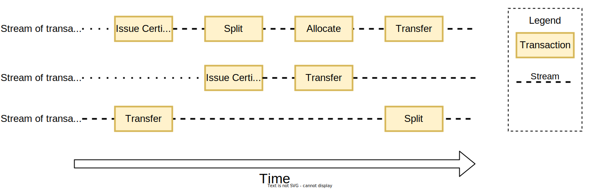

# Transactions and streams

Everything in Project Origin on a registry happens through a transaction, and every transaction relates to a specific stream on a registry.

## Transactions

A transaction is a request to a registry to perform a given action on a stream.

A transaction is always an atomic operation, meaning that it either succeeds or fails, and only makes a change to a single stream.

A transaction is always signed by the a valid entity.
For an existing certificate, the entity must be the owner of the slice one wants to perform an action on.
For a new certificate, the entity must be an issuing body.

A registry then verifies the signature and the validity of the transaction and if everything is valid, it will be recorded on the stream.

A [network](./network.md) might set specific rules that apply for certificates in a network.
For example, a network might require that all certificates must be issued containing a specific attribute or
other rules that apply for transactions to be valid.

A transaction is final and cannot be changed once it has been recorded on the stream and included in a block.

## Streams

An stream is a list of transaction that relates to a specific certificate on a registry.

A stream is created by a [issue transaction](./granular-certificates/transactions/issue.md).

All transactions on streams are recorded sequentially and are immutable. Once a transaction is recorded, it cannot be changed.

The registries use these streams to be able to process multiple streams in parallel while ensuring that the order of transactions on a stream must be sequential to ensure that no double-spending can occur.

Compensating transactions can be performed on some transactions to revert an action, but it will always be recorded on the stream.

