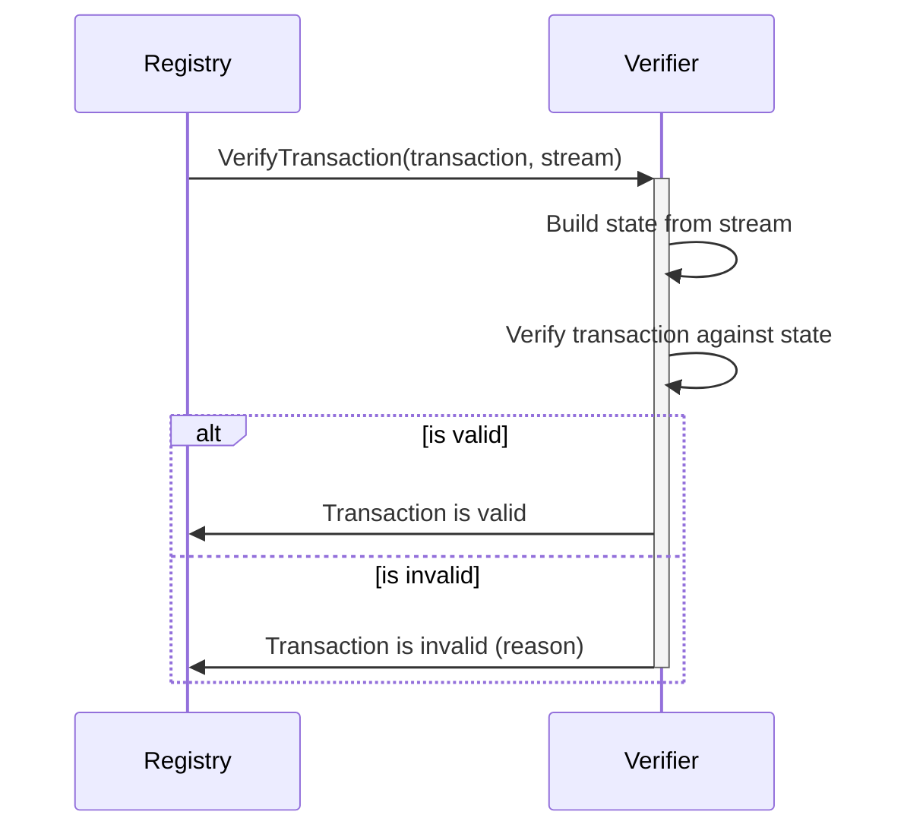

# Verifier

A **system** that verifies the validity of a transaction, based the state of the [stream](./transactions.md#streams) and the ruleset.

## Description

The verifier is a self contained system, that implements a single gRPC endpoint that takes a transaction and a stream of transactions,
and returns a boolean value indicating if the transaction is valid or not.

The verifier is programmed and configured with a ruleset, that defines the rules for the transactions (rules of the network).

The verifier gets the current state of the stream (the list of transactions) and the transaction to verify.
It then uses stream to build the actual state of the object, and based on the ruleset, it verifies the transaction.
It returns a boolean value, indicating if the transaction is valid or not, and if not, it returns a reason why.

## Ruleset

The ruleset for different transactions can very if they are only code based or partly configurable.

The issuer verifier are configured with which issuer keys are valid for each `grid area`.

## Verifier API

Below is the protobuf definition for the verifier API.

[!code-protobuf]

## Example verifier issuer verifier

Below one can see a implemented verifier.
It takes, the transaction, the state object, and deserialized transaction, and verifies if it is valid based on the rules.

[!code-csharp]

## System documentation

More documentation can be found in the [verifier electricity](../verifier_electricity/index.md) project.
