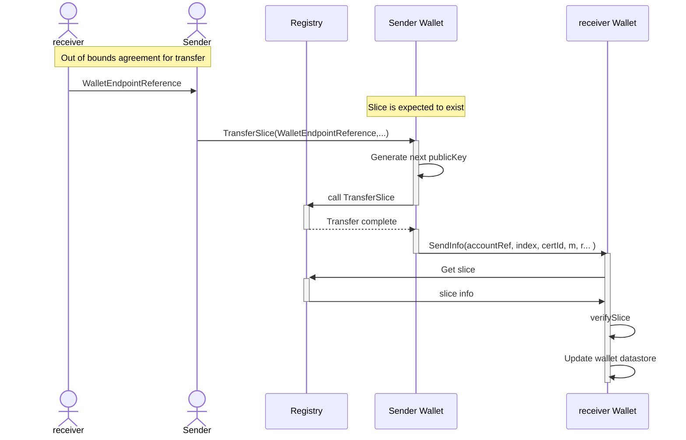

# Wallet (Concept)

Since data in the system is stored in a decentralized manner across multiple registries,
and ownership of data is represented by cryptographic keys,
the users need a way to manage their ownership of digital assets across multiple registries in a simple and secure way.

The wallet is a fundamental component which stores and manages the ownership of digital assets, specifically Granular Certificates (GCs) and their corresponding slices.

The wallet are based on the concept og Hierarchical Deterministic Keys (HD Keys) to ensure the uniqueness and security of keys used for each slice,
and to provide a secure and convenient way to manage ownership of GCs within the system.

> [!NOTE]
> We never reuse public keys, since it can be used to link ownership of slices together.
> Which could enable third parties to track ones ownership of slices, and potentially link it to other data.
> This is why we use HD keys to generate unique public keys for each slice.

The wallet must also store cryptographic data about the slices, like quanity, random secret, and attributes.

## Cryptographic data

Since GCs on the registries only stores commitments to the data, the wallet must store the actual data and cryptographic data about the slices.

The cryptographic data includes:
- Quantity of the slice
- Random secret used in the commitment
- Hashed attributes of GC
- Which private key to use for signing transactions

## Wallet endpoints

To ensure we always use unique public keys for each slice, we use HD keys to generate unique public keys for each slice.

Wallet endpoints are a concept to enable secure and private asset transfers and ownership management.

When Alice wants to transfer a slice to Bob, Bob must first create a wallet endpoint and share the public key of the endpoint with Alice.
Alice then uses the public key to sequecially generate unique child public keys for each slice she wants to transfer to Bob.
Alice then signs the transaction with her private key and sends the transaction to the registry.
Alice' wallet then sends the private information to Bobs wallet, using the public key of the endpoint, and position of the slice.

